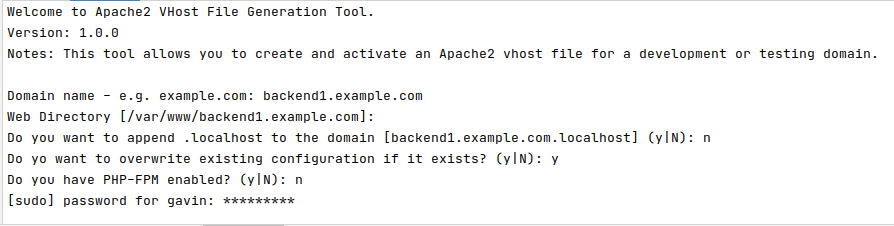
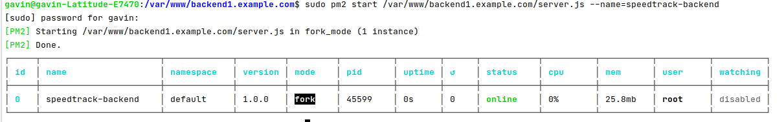

# SpeedTrack &trade; Bandwidth Speed Monitor

This application is a backend service that provides an API endpoint to be used by 
the React client to fetch speed data.

This application i.e. the whole `/backend` folder must be installed on a web server.
In this example we will host the application we will host it on an Ubuntu server with `apache2`, `nodejs` and `pm2` 
installed and running.

## Server Setup

1. Configure your web server using [lampset](https://github.com/gmurambadoro/lampset). You may also need to 
   install [lampset-vhost-add](https://github.com/gmurambadoro/lampset-vhost-add) to be able to easily add 
   virtual hosts on your server.
1. [Download](https://nodejs.org/en/download/) and install [NodeJs](https://nodejs.org/en/) - preferably install the most recent stable version.
1. Download and install [PM2](https://pm2.keymetrics.io/). PM2 is a process manager and it is responsible for ensuring that your node applications are always online.

## Installation

1. Clone this repository somewhere on your machine.
    - `git clone https://github.com/gmurambadoro/speedtrack-full-stack.git`
1. Run the `install.sh` script in the `speedtrack-full-stack` folder.
    - `bash install.sh`
1. The installer script will ask you for the following environment variables:
   
   - `FRONTEND_DIR` - the directory name relative to `/var/www/` that will hold the frontend files e.g. `frontend.example.com`
   - `BACKEND_DIR` - the directory name relative to `/var/www/` that will hold the backend files e.g. `backend.example.com`
   - `BACKEND_URL` - the hostname for the backend speed API. This is required by the frontend when connecting to the backend
   API service e.g. `http://backend.example.com`.
     
1. When successfully completed, your two apps will be located in the `/var/www/` folder

## Setting Up Virtual Host Configurations 

You can use [lampset-vhost-add](https://github.com/gmurambadoro/lampset-vhost-add) to register host names for the
frontend and frontend apps if you have not already done that before.

Simply type in `lampset-vhost-add --interactive` for each application, and you will be guided in the setup process. 
Because the applications are JavaScript-based, you can disable *php-fpm* because it is not required.



## Setting PM2 for the Backend

The backend is run as a `nodejs` application that runs at the `http://localhost:5000` endpoint. 
We need to configure `apache2` so that it is able to *proxy* all traffic coming to the backend host
`http://backend.example.com` configured via `BACKEND_URL` in the installation procedure above to `http://localhost:5000`.

The following is a once-off process and does not have to be repeated for each build.

```bash

sudo en2mod proxy
sudo a2enmod proxy_http
sudo a2enmod proxy_balancer 
sudo a2enmod lbmethod_byrequests
sudo systemctl restart apache2

```

Now modify the file `/etc/apache/sites-available/backend.example.com.conf` to enable the proxy service.
Restart `apache2` when done using `sudo systemctl restart apache2`.

```
<VirtualHost *:80>
    ServerName backend.example.com

    ProxyRequests on
    ProxyPreserveHost On
    ProxyPass / http://localhost:3000/
    ProxyVia Full
    <Proxy *>
      Require all granted
    </Proxy>

    <Location />
      ProxyPass http://127.0.0.1:5000/
      ProxyPassReverse http://127.0.0.1:5000/
    </Location>

    DocumentRoot /var/www/backend.example.com
    <Directory /var/www/backend.example.com>
        AllowOverride All
        Order Allow,Deny
        Allow from All
    </Directory>
    
    

    ErrorLog /var/log/apache2/backend.example.com_error.log
    CustomLog /var/log/apache2/backend.example.com_access.log combined
</VirtualHost>
gmurambadoro@OptiPlex-790:~$ 
```

At this point all traffic that comes to `http://backend.example.com` will be automatically routed to the `nodejs` 
service at running `http://localhost:5000`.

## PM2 - Keeping the NodeJS Service Alive

The `backend` is a `nodejs` process of the following file `/var/www/backend.example.com/server.js`. 
This service can be started via the command `node /var/www/backend.example.com/server.js`.

However, this alone is not enough and we need some kind of process manager to ensures that the service is always available.

This is where we need [pm2](https://pm2.keymetrics.io/). Based on their website:

*"PM2 is a daemon process manager that will help you manage and keep your application online 24/7"*

1. Ensure that `pm2` is installed by running the following command as `sudo`.

   `sudo npm install pm2 -g`

1. Activate `pm2` service so that it is able to run as a service and automatically start on system boot.
   
   `sudo pm2 enable`

1. Add the `server.js` service to the `pm2`'s watchlist.

   ```bash
   sudo pm2 start /var/www/backend.example.com/server.js --name=speedtrack-backend
   sudo pm2 list
   ```

   

1. The `server.js` process is now being monitored by `pm2` and will be restarted automatically if it terminates and 
   at boot time. You can check the status of this process via `sudo pm2 status`.

1. Additional commands for `pm2` can be obtained via `pm2 --help`.

**NB:** After every build, ensure that you restart the server process via `sudo pm2 restart speedtrack-backend`.

## References

1. [Run NodeJS with PM2 and Apache 2.4 on Ubuntu 18.04](https://www.serverlab.ca/tutorials/development/nodejs/run-nodejs-with-pm2-and-apache-2-4-on-ubuntu-18-04/)
1. [How to get Apache and Node working together on the same domain with Proxied Javascript AJAX requests](https://blog.cloudboost.io/get-apache-and-node-working-together-on-the-same-domain-with-javascript-ajax-requests-39db51959b79)
1. [Linux, Apache, PHP & MySQL Setup (lampset)](https://github.com/gmurambadoro/lampset)
1. [LAMPSET Virtual Host Manager](https://github.com/gmurambadoro/lampset-vhost-add)

